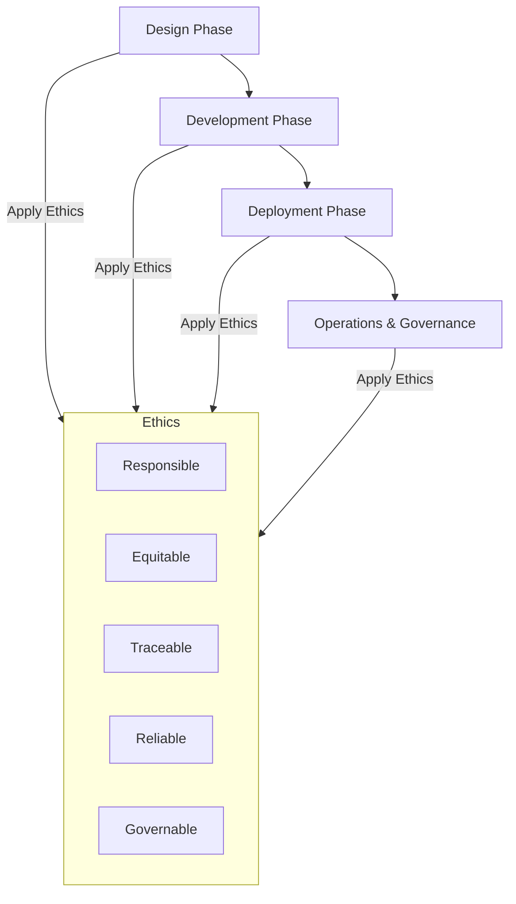

# Applying AI Ethics to Agentic AI / AI Agents

## Why AI Ethics Matters
Agentic AI differs from traditional models because it can **act autonomously**, make decisions, and chain actions across tools, APIs, or environments. This creates greater impact potential—both positive and negative—making **ethical design and oversight essential**.

Applying AI ethics ensures:
- **Trustworthiness** in outputs  
- **Fairness and inclusivity** in decision-making  
- **Accountability** for developers and operators  
- **Alignment with human values and governance structures**  

---

## DoD AI Ethical Principles Applied to AI Agents

| Principle      | Application for AI Agents |
|----------------|----------------------------|
| **Responsible** | Maintain clear **human accountability**. Always keep a human-in-the-loop (or on-the-loop). Document responsibility for deployment and monitoring. |
| **Equitable**  | Ensure the agent avoids bias by curating balanced datasets, testing across diverse scenarios, and auditing for unintended discrimination. |
| **Traceable**  | Require **transparency and auditability**. Log reasoning steps, data sources, and decisions so humans can review why an agent acted in a certain way. |
| **Reliable**   | Design for **robustness and safety**. Test in varied conditions, add safeguards (validation checks, rollbacks) before real-world actions. |
| **Governable** | Build **override and shutdown mechanisms**. Agents must be stoppable, adjustable, and aligned with governance rules and laws. |

---

## Practical Steps

### 1. **Design Phase**
- Define the **scope and limits** of autonomy.  
- Align objectives with organizational ethics frameworks.  
- Embed principles like *do no harm* and *minimize bias* early.  

### 2. **Development Phase**
- Use **explainable AI** techniques to make reasoning visible.  
- Include **bias detection and mitigation pipelines**.  
- Simulate failure modes (red teaming, adversarial testing).  

### 3. **Deployment Phase**
- Implement **human oversight protocols** (approval checkpoints, escalation paths).  
- Monitor with **dashboards** to track actions and outcomes.  
- Establish **feedback loops** to improve alignment.  

### 4. **Operations & Governance**
- Document every agent’s **capabilities, limits, and risks**.  
- Conduct **regular audits** for ethical compliance.  
- Provide **training and awareness programs** for staff and stakeholders.  

---

## Example Applications
- **Scheduling Agent**: Must respect privacy, ensure fairness, and log decision rationale.  
- **Robotics Navigation Agent**: Must be reliable (tested), governable (emergency stop), and responsible (operator accountable).  

---

## Diagram: Ethics Across the Agent Lifecycle

---

## Key Takeaway
Applying AI ethics to Agentic AI means embedding **responsibility, fairness, transparency, reliability, and governance** into every stage of design, deployment, and oversight—never leaving critical decisions entirely to the agent without human accountability.
