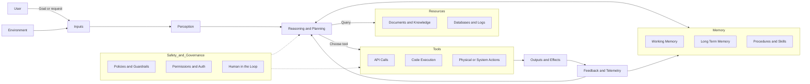
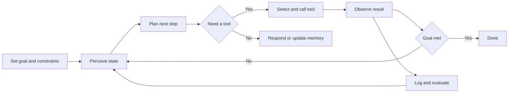

# Agentic AI — Essential Parts of an Agent

This one-pager summarizes the core layers most practical agents share and includes two GitHub-friendly Mermaid diagrams.

## The Essential Parts of an Agent

1. **Identity & Objectives**  
   Define role/system prompt, goals, success criteria, and constraints (budget, time, policies).

2. **Perception (Inputs)**  
   What the agent can observe: user messages, files, APIs, sensors, events, or webhooks.

3. **Reasoning & Planning**  
   LLM-driven reasoning and planners/decomposers that turn goals into steps (e.g., ReAct, tool-use planning, tree/graph search).

4. **Memory**  
   - **Working memory**: transient scratchpad/context for the current task.  
   - **Short-/long-term memory**: vector store, KV facts, episodic logs.  
   - **Procedural/skills memory**: reusable plans, playbooks, tool recipes.

5. **Tools & Skills (Actuators)**  
   Callable functions that *change* the world: APIs, code execution, database writes, messaging, schedulers, robotics control. Tools should be typed/schematized, permissioned, and have pre/post-conditions.

6. **Resources (Knowledge & Data)**  
   Read-mostly sources the agent *consults*: documents, KBs, databases, calendars, telemetry, budgets. Often retrieved via RAG or search.

7. **Execution & Orchestration**  
   The control loop that coordinates perception → planning → tool use → feedback → memory updates until the goal is met (or timed-out).

8. **Feedback, Evaluation & Learning**  
   Self-checks/critics, tests, reward signals, retries, reflection, and updates to prompts, tools, or memory based on outcomes.

9. **Safety & Governance**  
   Guardrails, permissions, sandboxes, policy enforcement, human-in-the-loop, audit logs, and compliance/ethics constraints.

10. **Monitoring & Telemetry**  
    Tracing, metrics, costs, latency, and tool success/error rates to improve reliability, performance, and cost control.

---

### Quick distinction: Resources vs. Tools
- **Resources = read:** knowledge the agent *consults* (docs/KBs, embeddings, logs, maps, budgets).  
- **Tools = act:** capabilities the agent *uses to do things* (search, db write, email, move robot arm).  
Some features are hybrids (e.g., a “search” tool *uses* a resource).

### Minimal control loop (mental model)
**Goal → Perceive → Plan → Act (via tool) → Observe → Update (memory/safety) → Repeat → Done.**

---

## Visual Diagrams (GitHub-friendly Mermaid)

> Mermaid renders automatically on GitHub when used inside fenced code blocks.

### 1) Agent Architecture — Components and Data Flow

### 2) Perceive–Plan–Act Control Loop

