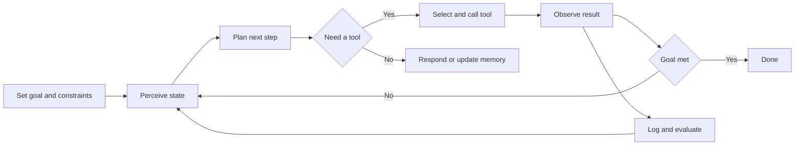

# Agentic AI — Core Components and Control Loop

This file includes two GitHub-friendly Mermaid diagrams:
1) **Agent Architecture** — how the major parts connect.
2) **Perceive–Plan–Act Loop** — the control loop the agent follows.

> Tip: On GitHub, Mermaid renders automatically inside fenced code blocks.

---

## 1) Agent Architecture (Components and Data Flow)

```mermaid
flowchart LR
  %% Direction
  %% Keep syntax simple to maximize GitHub compatibility

  U[User] -->|Goal or request| I[Inputs]
  ENV[Environment] --> I
  I --> P[Perception]
  P --> R[Reasoning and Planning]

  %% Memory
  subgraph Memory
    WM[Working Memory]
    LT[Long Term Memory]
    PM[Procedures and Skills]
  end
  R <--> Memory

  %% Resources (read-mostly knowledge and data)
  subgraph Resources
    KB[Documents and Knowledge]
    DB[Databases and Logs]
  end
  R -->|Query| Resources

  %% Tools and actuators (write or act)
  subgraph Tools
    API[API Calls]
    CODE[Code Execution]
    ACT[Physical or System Actions]
  end
  R -->|Choose tool| Tools
  Tools --> O[Outputs and Effects]

  %% Feedback and telemetry
  O --> F[Feedback and Telemetry]
  F --> R
  F --> Memory

  %% Safety and governance (guardrails)
  subgraph Safety_and_Governance
    POL[Policies and Guardrails]
    PERM[Permissions and Auth]
    HIL[Human in the Loop]
  end
  Safety_and_Governance -.-> R
  Safety_and_Governance -.-> Tools
```

---

## 2) Perceive–Plan–Act Control Loop

