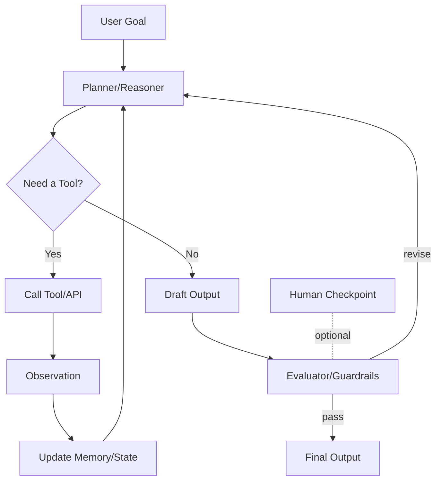

# Agentic Frameworks — Overview & Quickstart

> A practical, vendor‑neutral guide to the major **agentic AI frameworks**—toolkits and runtimes for building agents that can plan, call tools/APIs, keep state/memory, and act safely.

---

## Executive Summary

- **Agentic frameworks** give you *primitives* for: tool‑use, planning, state/memory, guardrails, evaluation, and orchestration.
- Pick based on **orchestration model** (loop vs. graph), **reliability needs** (durable state & HIL), **cloud/platform fit**, and **multi‑agent** requirements.
- Start **simple**: a single‑agent ReAct loop + 1–3 tools, then move to graphs or multi‑agent only when the problem demands it.

---

## What “Agentic Framework” Means (in practice)

A framework qualifies if it provides most of the following:

- **Reason/Plan** primitives (or patterns)  
- **Tool/Function calling** with typed parameters  
- **State/Memory** (short‑term context + durable/long‑term)  
- **Orchestration** (loop or **state machine/graph**)  
- **Safety/Policy** guardrails and **evaluation** hooks  
- **Observability** (traces, logs, metrics, cost/latency)



---

## Selection Cheat‑Sheet

- **Explicit control, reliability, HIL, resumable runs** → **LangGraph** (graph/state machine).  
- **Multi‑agent collaboration** (specialized roles, talking agents) → **CrewAI** or **AutoGen**.  
- **RAG‑centric assistants over private data** → **LlamaIndex Agents**.  
- **Microsoft stack / enterprise integrations** → **Semantic Kernel (SK)**.  
- **OpenAI platform features (agents, computer use)** → **OpenAI Agents**.  
- **Google Cloud / Gemini / Vertex AI** → **Google Agent Development Kit (ADK)**.

> You can mix and match: e.g., build tools once (JSON‑schema), reuse across runtimes.

---

## Quick Feature Matrix (high‑level)

| Framework | Primary Languages | Orchestration Model | Multi‑Agent | Memory/State | Tooling | Eval/Guardrails Hooks | Typical Sweet Spot |
|---|---|---|---|---|---|---|---|
| **LangGraph** | Python, JS/TS | **Graph / State Machine** | Via graph | Strong (durable checkpoints) | Functions/Tools | Built‑in interception points | Reliable workflows, HIL, recoverability |
| **CrewAI** | Python | Loop + role workflows | **Yes** (crews/roles) | Via memory stores | Tools & skills | Critic/reviewer patterns | Fast multi‑agent prototyping/automation |
| **AutoGen** | Python | Conversation loops | **Yes** (conversational agents) | Via histories/stores | Tools/code execution | Critic/debate patterns | Research & collaborative problem solving |
| **OpenAI Agents** | Python/JS via API | Platform agent loop | Single or multi | Platform memory options | Tools (function calling), computer use | Safety built‑ins + policies | Rapid platform‑native agents |
| **Google ADK** | Python, Java | Agent & **multi‑agent** | **Yes** | Integrates with Vertex/Gemini | Tools/toolkits | Eval suites (Vertex) | GCP‑native agents (Gemini/Vertex) |
| **Semantic Kernel** | C#, Python, Java | Planner/executor + pipelines | Via plugins | SK memory abstractions | Functions/Plugins | Filters, policies | Microsoft/.NET enterprise |
| **LlamaIndex Agents** | Python, JS/TS | Loop + RAG pipelines | Optional | Vector/graph indexes | Tools + connectors | Eval via LlamaIndex evals | **RAG‑first** assistants over data |

> Notes: This is conceptual and intentionally version‑agnostic.

---

## Framework Profiles (When to Use, Strengths, Trade‑offs, Mini‑Start)

### 1) LangGraph (LangChain)
- **Use when** you need fine‑grained control, **durable** state, HIL, and recoverable workflows.  
- **Strengths:** Explicit **graph/state** orchestration, tight control, good for prod.  
- **Trade‑offs:** More design upfront; slightly steeper learning curve.

**Hello (conceptual)**:
```python
# pip install langgraph langchain-openai
from langgraph.graph import StateGraph

def plan(state): ...
def maybe_call_tool(state): ...
def evaluate(state): ...

g = StateGraph()
g.add_node("plan", plan)
g.add_node("act", maybe_call_tool)
g.add_node("eval", evaluate)
g.add_edge("plan", "act")
g.add_conditional_edges("act", lambda s: "eval" if s["done"] else "plan")
app = g.compile()

result = app.invoke({"goal": "Summarize a PDF and propose 3 actions"})
```

---

### 2) CrewAI
- **Use when** you want **multi‑agent** teams with defined roles (Researcher, Coder, Reviewer).  
- **Strengths:** Quick to spin up crews & workflows; role prompts.  
- **Trade‑offs:** Less explicit state machine; tune roles for reliability.

**Hello (conceptual)**:
```python
# pip install crewai
from crewai import Agent, Task, Crew

researcher = Agent(role="researcher", goal="gather facts via tools")
writer = Agent(role="writer", goal="compose concise brief")

task = Task(description="Write a 1-page brief on topic X", agents=[researcher, writer])
crew = Crew(agents=[researcher, writer], tasks=[task])
crew.kickoff()
```

---

### 3) AutoGen (Microsoft Research)
- **Use when** agents **converse** to solve tasks (proposer/critic, coder/reviewer).  
- **Strengths:** Dialogue‑centric **multi‑agent**; great for experiments.  
- **Trade‑offs:** Conversation loops can drift; add evaluators/limits.

**Hello (conceptual)**:
```python
# pip install pyautogen
from autogen import AssistantAgent, UserProxyAgent

assistant = AssistantAgent(name="assistant")
user = UserProxyAgent(name="user", human_input_mode="NEVER")
user.initiate_chat(assistant, message="Design tests for a calculator API")
```

---

### 4) OpenAI Agents (Platform)
- **Use when** you want platform‑managed agents, tool calling, and **computer use**.  
- **Strengths:** Tight model integration, safety features, tool schemas.  
- **Trade‑offs:** Platform coupling; treat as managed runtime.

**Hello (conceptual)**:
```python
# pip install openai
from openai import OpenAI
client = OpenAI()

# Pseudocode: define tools, then create/run an agent
agent = client.agents.create(name="helper", instructions="Assist with tasks", tools=[...])
run = client.agents.runs.create(agent_id=agent.id, input="Summarize this URL and list 3 risks.")
```

---

### 5) Google Agent Development Kit (ADK)
- **Use when** on **GCP/Vertex/Gemini**, need multi‑agent & eval tooling.  
- **Strengths:** Cloud‑native integrations & deployment.  
- **Trade‑offs:** Cloud lock‑in; align to Vertex patterns.

**Hello (conceptual)**:
```python
# pip install google-genai   # example placeholder
from google.ai import agents

agent = agents.create(model="gemini-1.5-pro", tools=[...])
resp = agent.run({"goal": "Classify and route incoming tickets"})
```

---

### 6) Semantic Kernel (Microsoft)
- **Use when** you’re in the **.NET/Enterprise** world and want plugins, planners.  
- **Strengths:** Strong Microsoft ecosystem fit; plugins, filters.  
- **Trade‑offs:** Patterns differ by language; plan the structure.

**Hello (conceptual)**:
```python
# pip install semantic-kernel
import semantic_kernel as sk

kernel = sk.Kernel()
# add connectors/tools, create planner, execute steps...
```

---

### 7) LlamaIndex Agents
- **Use when** you need **RAG‑first** assistants over private/enterprise data.  
- **Strengths:** Indexing, retrieval graphs, evals, data connectors.  
- **Trade‑offs:** Best for knowledge workflows; pair with other runtimes for complex orchestration.

**Hello (conceptual)**:
```python
# pip install llama-index
from llama_index.core.agent import ReActAgent

agent = ReActAgent.from_tools([...], system_prompt="Answer using the docs.")
agent.chat("What changed in the v2.1 release notes?")
```

---

## Pattern Fit (at a glance)

- **ReAct / Toolformer loop:** *All* support; easiest in CrewAI, LlamaIndex, OpenAI Agents.  
- **Planner → Executor:** LangGraph (explicit), SK (planner), CrewAI (roles).  
- **Supervisor → Workers:** CrewAI, AutoGen, LangGraph (graph).  
- **RAG Assistant:** LlamaIndex, LangGraph(+RAG), SK.  
- **HIL Gateways:** LangGraph (graph checkpoints), platform gates (OpenAI Agents), custom in others.

---

## Safety, Ethics & Governance Hooks

Use **lightweight gates** aligned with the DoD AI principles:

- **Responsible:** Human approval on high‑impact actions (HIL).  
- **Equitable:** Bias tests on outputs; eval across groups.  
- **Traceable:** Log tool calls, parameters, and data lineage.  
- **Reliable:** Golden tasks, unit tests for tools, canaries in pre‑prod.  
- **Governable:** Off‑switches, deny‑lists, scope/permission policies.

**Where to wire these:**
- **Before tool call:** policy checks, schema validation, allow‑list.  
- **After observation:** evaluator/critic; retry or revise.  
- **At state transitions:** graph checkpoints; audit & rollback.  

---

## Interop Tips (MCP‑ready Tools)

- Define **tool schemas** (JSON/YAML) with required/optional params.  
- Keep tools **stateless** when possible; push state into the runtime.  
- Emit **structured events** (for tracing/eval) regardless of framework.  
- Target **reusable tools** so you can swap runtimes without rewrites.

---

## Getting Started (Any Framework)

1. **Define task & metrics** (success rate, latency p95, cost cap).  
2. **Select 1–3 tools** and write **schemas** (and tests).  
3. **Implement loop/graph** + add **HIL** where needed.  
4. **Add evaluation** (5–10 golden tasks) before shipping.  
5. **Turn on tracing**; log tool calls, token use, timing.  
6. **Iterate**: measure → tighten prompts/tools → reduce failure modes.

---

## FAQ

- **Which should I learn first?** Start with a simple **ReAct loop** (e.g., LlamaIndex or CrewAI), then learn **LangGraph** for production‑grade orchestration.  
- **Can I combine them?** Yes—use LlamaIndex for RAG and LangGraph for workflow control, for example.  
- **How do I migrate later?** Keep a clean **tool boundary** with schemas and write adapters.

---

## License

MIT (or your project’s license).
