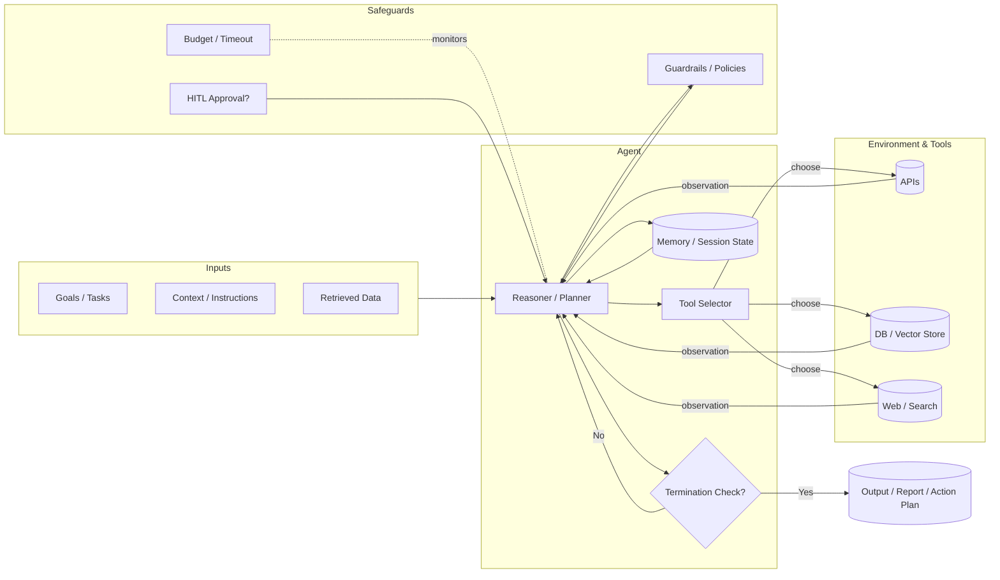
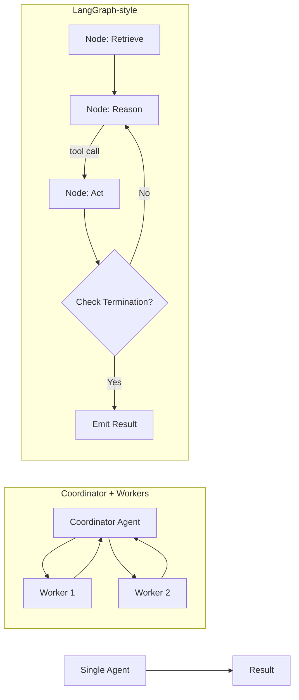
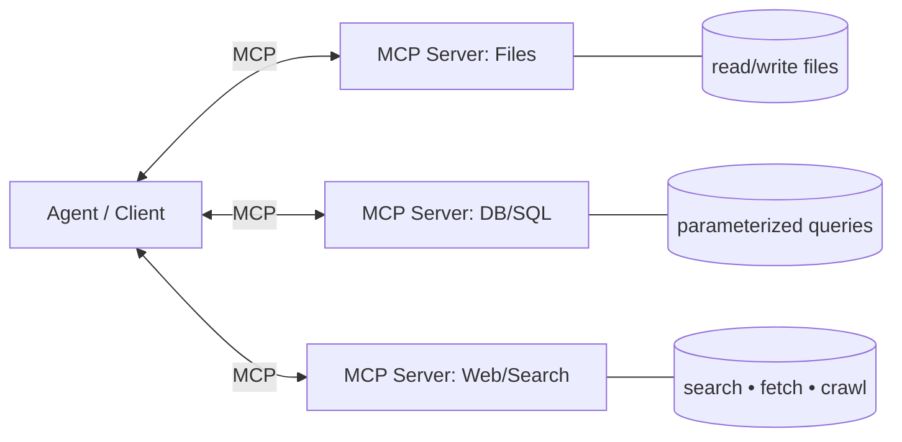
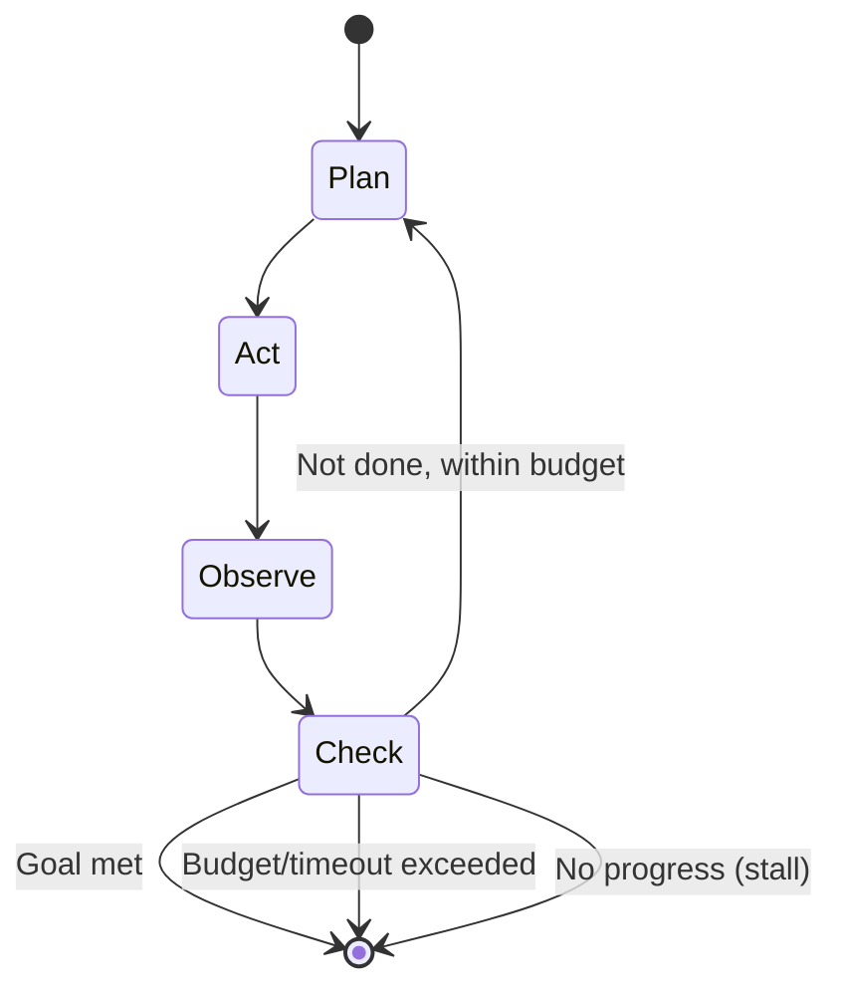
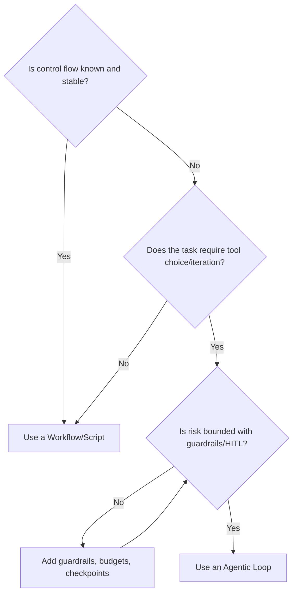
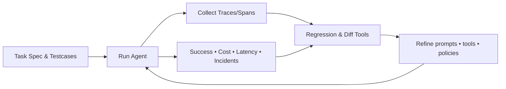

# Visualizing Agentic Systems (Handout)

These diagrams are **ready to paste** into your Study_Guide.md or GitHub docs. They visualize agents per our definition: *a system that uses an LLM in a loop of reasoning + acting, guided by goals and context, choosing tools, with guardrails, HITL, memory, and clear termination criteria.*

---

## 1) Agent Control Loop (core mental model)



**Read it like this:** goals + context feed a **Reasoner** that selects tools, collects observations, updates **Memory**, checks **guardrails/budget/HITL**, and repeats until **termination criteria** is met.

---

## 2) Agent Anatomy (what’s inside an agent)

```mermaid
flowchart TB
  subgraph Agent[Agent]
    P[Policy / Instructions]
    R[Reasoning Engine (LLM)]
    MS[(Memory Store)]
    EV[Evals / Tracing Hooks]
    GA[Guardrails: schemas • allowlists • PII filters]
    AU[Autonomy: step limits • budgets • timeouts]
    TS[Tooling Adapters]
  end

  subgraph Interfaces
    IN[Inputs: goals • user msgs • events]
    OUT[Outputs: answers • actions • artifacts]
  end

  subgraph External
    TOOLS[(APIs • DBs • Search • File I/O)]
    DATA[(Docs • Vector DB • KB)]
  end

  IN --> P --> R
  R -->|read/write| MS
  R -->|via| TS --> TOOLS
  R --> DATA
  GA --> R
  AU --> R
  EV --> R
  R --> OUT
```

**Notes:** treat **Memory** as data you can version/audit. **Guardrails** and **Autonomy** are first‑class, not afterthoughts.

---

## 3) Orchestration Patterns (from simple to complex)



**Map to frameworks:** Single agent (OpenAI Agents SDK); Coordinator/workers (AutoGen, CrewAI); Graph loop (LangGraph).

---

## 4) HITL & Guardrails (who’s in control)


**Idea:** Explicit **checkpoints** for risky actions (payments, data writes).

---

## 5) MCP (Model Context Protocol) as the ACI



**Why it matters:** **Standardizes** how agents discover/call tools & data. Servers expose capabilities; clients (agents) consume them consistently.

---

## 6) Autonomy & Termination (state view)



**Make this concrete** with thresholds: step_limit, money_limit, time_limit, no_improvement_k.

---

## 7) Workflow vs Agent (decision helper)



**Rule of thumb:** Prefer scripts for deterministic tasks; reserve agents for **open‑ended** goals needing tool choice + iteration.

---

## 8) Evals & Telemetry (close the loop)



**Outcome:** A measurable improvement loop, not vibes.

---

### Tips for Use
- Paste any diagram into GitHub markdown (Mermaid supported).  
- Create variants per framework (OpenAI Agents SDK, CrewAI, LangGraph, AutoGen).  
- Keep **guardrails/HITL/budgets** visible in every picture to reinforce safety and control.
