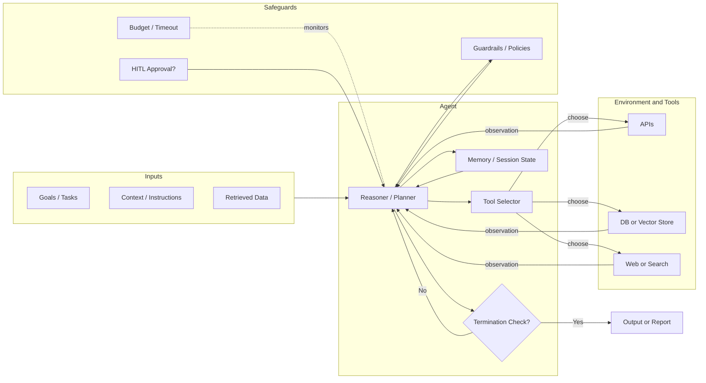
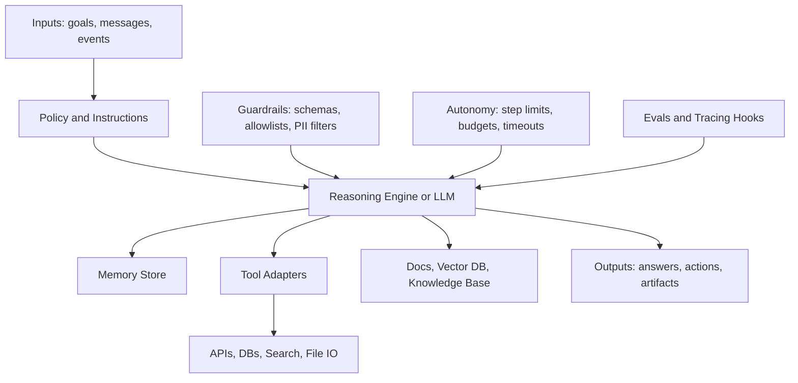
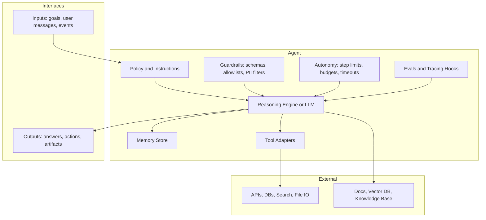
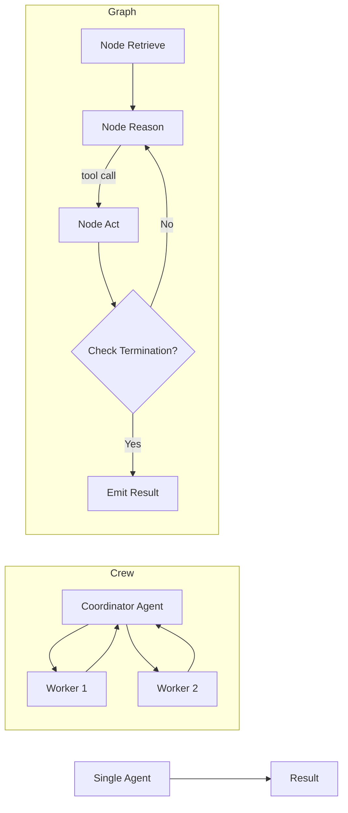
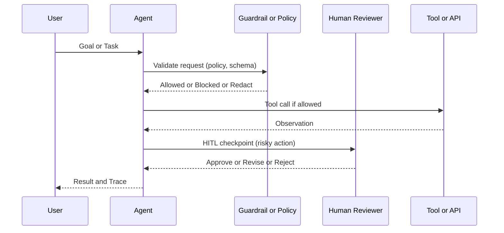
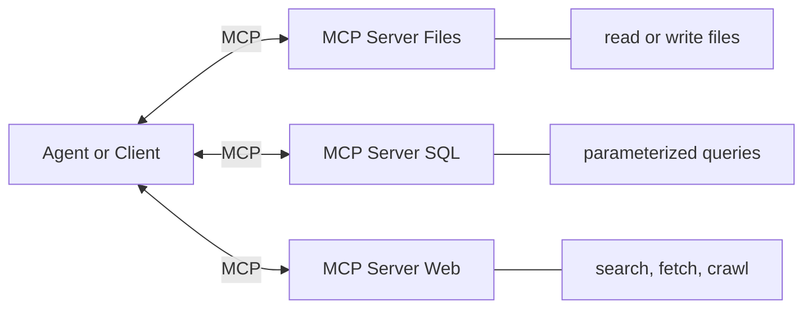
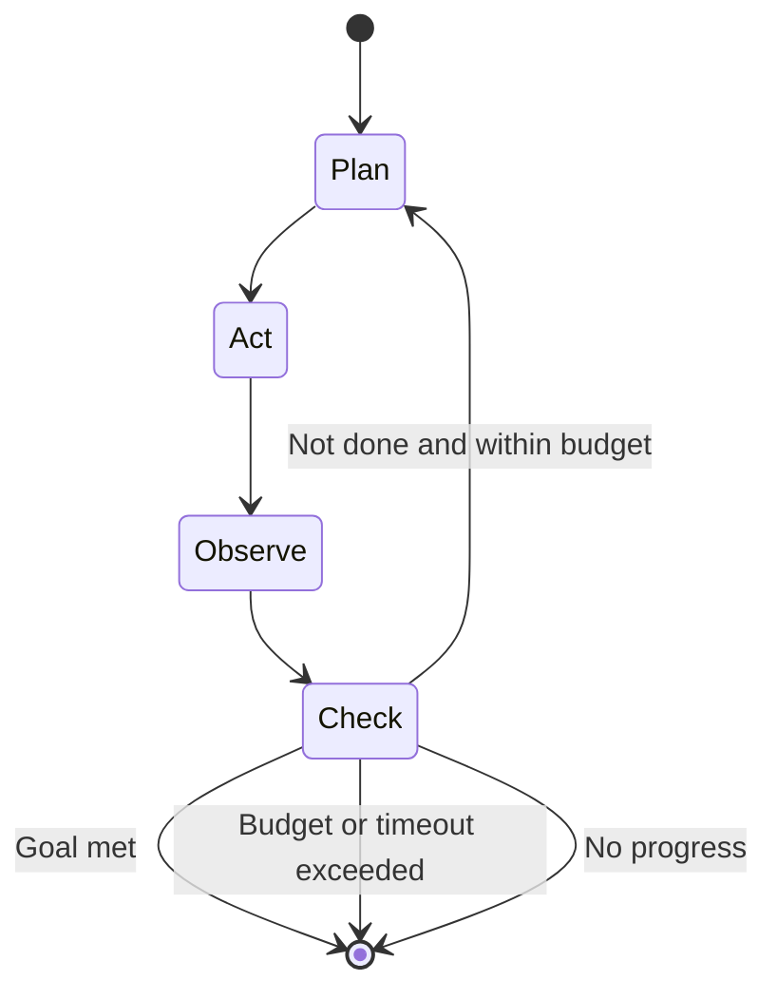
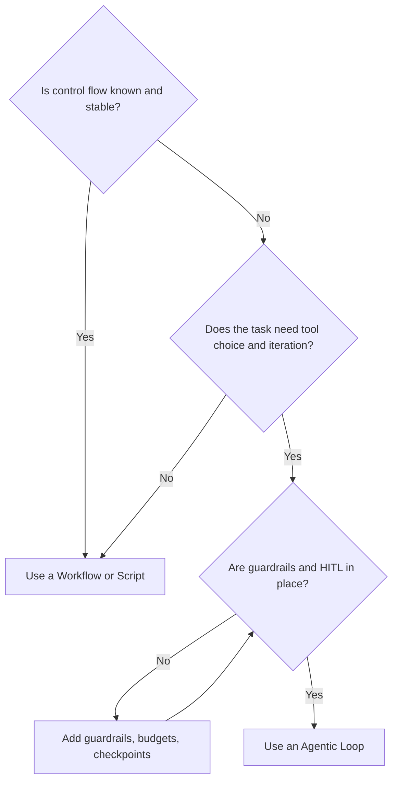
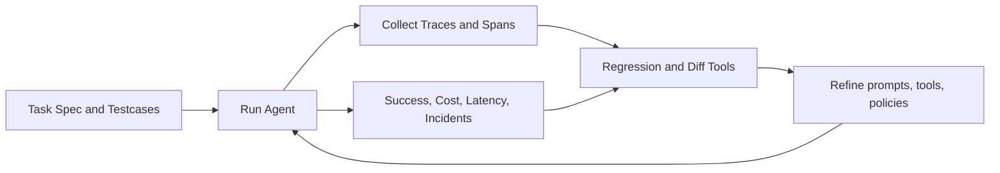

# Visualizing Agentic Systems (GitHub‑safe Mermaid)

---

## 1) Agent Control Loop (core mental model)

---

## 2) Agent Anatomy (what is inside an agent)

### 2A. Minimal version (no subgraphs, maximally compatible)

### 2B. Subgraph version

---

## 3) Orchestration Patterns (from simple to complex)

---

## 4) HITL and Guardrails (who is in control)

---

## 5) MCP (Model Context Protocol) as the ACI

---

## 6) Autonomy and Termination (state view)

---

## 7) Workflow vs Agent (decision helper)

---

## 8) Evals and Telemetry (close the loop)

---

