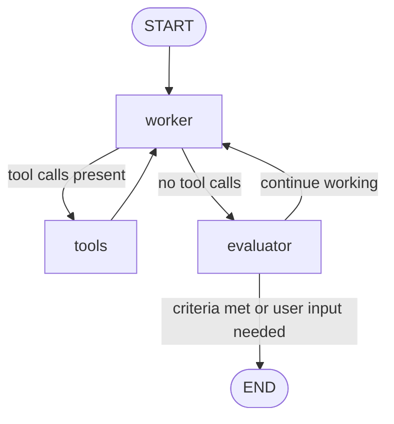
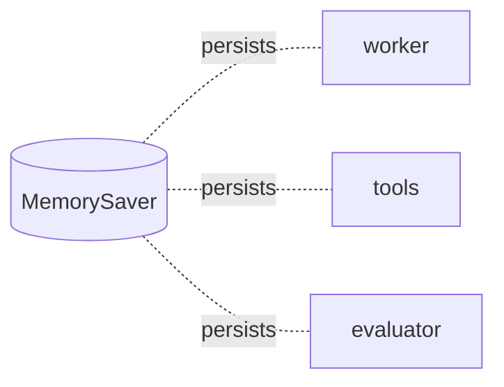

# Lab 5 — Sidekick: LangGraph Diagram 

This version fixes Mermaid syntax so it renders on GitHub.

## Main Flow

## Checkpointing (Memory)

## Notes
- **worker**: primary reasoning node bound to tools; may produce tool calls.
- **tools**: runs any tool calls created by the worker, then returns to worker.
- **evaluator**: provides feedback and decides whether to finish or loop.
- **MemorySaver**: persists state between steps using a thread ID.
