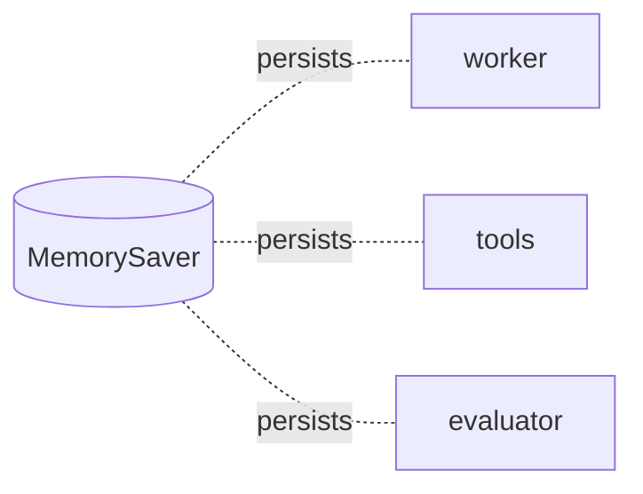
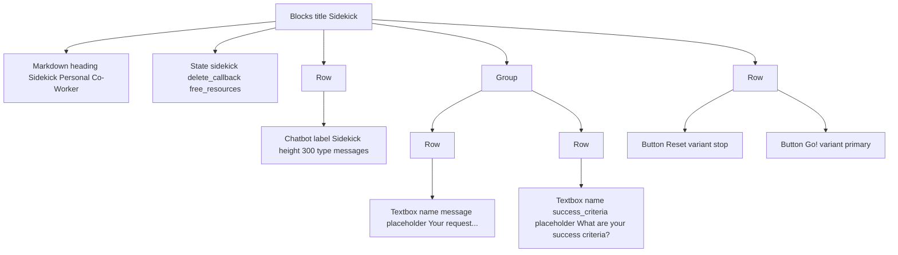
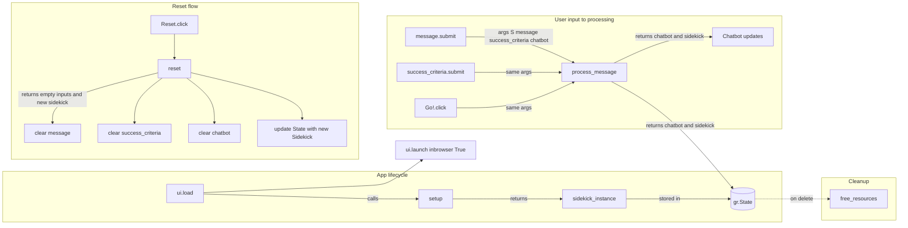

# Lab 5 — Sidekick: LangGraph Diagram 

## Main Flow

## Checkpointing (Memory)

## Notes
- **worker**: primary reasoning node bound to tools; may produce tool calls.
- **tools**: runs any tool calls created by the worker, then returns to worker.
- **evaluator**: provides feedback and decides whether to finish or loop.
- **MemorySaver**: persists state between steps using a thread ID.

# Lab 5 — Sidekick: Gradio UI Diagram

---

## Component Tree (Layout)

---

## Event Flow and Handlers

---

## Notes
- Chatbot shows the conversation history your agent produces.
- Both textboxes trigger `process_message` on submit; the Go button calls the same handler.
- Reset reinitializes the Sidekick, clears inputs and Chatbot, and updates the stored state.
- `free_resources` runs when the stored state is deleted.

