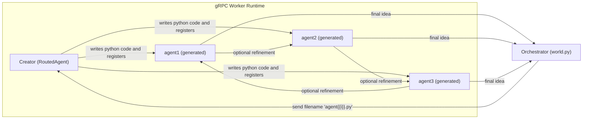

# Agentic AI Course — Week 5: AutoGen (Overview & Summary)

_Last updated: 2025-10-08_

This week focuses on building **multi‑agent systems with AutoGen**, using **Autogen Core**, **AgentChat**, and the **gRPC Worker Runtime** to compose agents that can **generate other agents**, register them at runtime, and **collaborate** on tasks. You’ll see a full, working pattern that scales up from a single “template” agent to a small swarm—each capable of bouncing ideas between one another.

---

## What you’ll learn

- **Autogen Core + AgentChat basics**: how to implement a `RoutedAgent` with message handlers and a delegated LLM assistant.
- **Agent generation at runtime**: a **Creator** agent that writes Python code for new agents from a template, then registers them dynamically.
- **gRPC Worker Runtime**: starting a host/runtime pair and registering agents over gRPC.
- **Simple multi‑agent collaboration**: agents forwarding their results to other agents for refinement.
- **Batch orchestration**: creating N agents and collecting their outputs concurrently.

---

## Repo layout for Week 5

- `agent.py` — a **template** agent that proposes/refines business ideas, and sometimes forwards them to another peer for improvements.
- `creator.py` — a **meta‑agent** that **generates brand‑new agent code** from the `agent.py` template and **registers** each new agent with the runtime.
- `messages.py` — lightweight utilities: a typed `Message` and a helper to **select a random peer** to receive a refinement request.
- `world.py` — the **orchestrator**: boots the **gRPC host/runtime**, registers the `Creator`, and **spawns N new agents**, saving each agent’s result to `idea{i}.md`.

---

## Architecture at a glance



**Flow summary**
1. **`world.py`** starts a **`GrpcWorkerAgentRuntimeHost`** and a **`GrpcWorkerAgentRuntime`**, registers the **Creator**, and spins up **N parallel tasks**.
2. Each task asks **Creator** to create a **new agent file** (e.g., `agent7.py`).
3. **Creator**: (a) uses an LLM to generate code from the **`agent.py` template**, (b) writes it to disk, and (c) **registers** the new agent with the runtime.
4. **Creator** sends a follow‑up message (e.g., “Give me an idea”) to the newly minted agent and **captures the response** in `idea{i}.md`.
5. The generated agent may **forward** its idea to a **random peer** for **refinement**, before returning its final answer.

---

## Key code walkthrough

### 1) Template agent (`agent.py`)
- Subclasses `RoutedAgent`, delegates to an `AssistantAgent` with a **sector‑biased system prompt**.
- On message, it sends the user content to the **LLM**, then sometimes **forwards** the result to a randomly chosen peer (using `messages.find_recipient()`).
- Returns the (possibly refined) **idea** to the caller.

### 2) Meta‑agent (`creator.py`)
- Also a `RoutedAgent`. Internally wraps an `AssistantAgent` with a **system message** instructing it to **produce Python code for a new agent** based on the template.
- **Reads `agent.py`**, constructs a **prompt**, and **writes** the LLM’s response to **`agent{i}.py`**.
- **Dynamically imports** the new module and **registers** it with the running runtime via `Agent.register(...)`.
- Finally, it **sends an initial message** to the newly minted agent and returns the reply upstream.

### 3) Utilities (`messages.py`)
- A tiny `Message` dataclass plus a function to **choose a random recipient** among files named `agent*.py` (excluding the base `agent.py`).

### 4) Orchestrator (`world.py`)
- Starts **gRPC host + worker runtime**.
- Registers **Creator** once, then launches **HOW_MANY_AGENTS** tasks concurrently.
- Each task requests a **new generated agent** and **saves** the resulting idea into `idea{i}.md`.
- Performs a **clean shutdown** (best‑effort) after tasks finish.

---

## How to run (typical flow)

1. Ensure your environment is set (API keys via `.env` where required by `OpenAIChatCompletionClient`).
2. Install dependencies:
   ```bash
   pip install autogen-core autogen-agentchat autogen-ext python-dotenv
   ```
3. Start the system:
   ```bash
   python world.py
   ```
4. Inspect results: look for newly created `agent*.py` files and `idea*.md` outputs.

> **Tip:** You can control batch size via `HOW_MANY_AGENTS` in `world.py`.

---

## Design patterns to remember

- **Template‑driven codegen**: use a **known‑good template** to constrain LLM code generation and keep method signatures stable.
- **Dynamic registration**: generated agents **self‑register** with the runtime, enabling scalable swarms.
- **Loose coupling via messages**: agents **talk through the runtime**, enabling substitution and A/B experiments.
- **Stochastic collaboration**: forward ideas to a random peer **some of the time** for diversity and improvement.

---

## Suggested extensions

- **Evaluation loop**: add an auto‑grader to score ideas and **route** the next refinement to a top‑performing peer.
- **Specialist roles**: generate agents with **different system prompts** (e.g., “Risk‑Analyst”, “Ethicist”, “Ops Realist”) and let a **Coordinator** choose who to consult.
- **Persistence**: log conversations to a store (SQLite / Postgres) and **replay** or **fine‑tune** your collaboration policy.
- **Guardrails**: add **input/output checks** or safety filters before registering a generated agent.

---

## Troubleshooting

- **No peers to refine**: ensure at least two generated `agent*.py` exist and **exclude** the base template from the pool.
- **Registration errors**: confirm `Agent.register(runtime, name, factory)` is called **after** the module import and class is defined.
- **Model issues**: verify your `.env` has the right keys and the requested model name is available.

---

## Key takeaways

- You can **bootstrap** a multi‑agent ecosystem from a **single template**.
- A **Creator** can safely **code‑generate** agents when you constrain method signatures and class structure.
- **gRPC Worker Runtime** provides a clean boundary for composing and scaling agents across processes.

---

### Credits & Files used this week

- `creator.py` — meta‑agent for code‑generating and registering peers
- `messages.py` — message dataclass + random peer selection
- `world.py` — gRPC host/runtime orchestration and batch creation
- `agent.py` — base template agent with optional peer refinement

